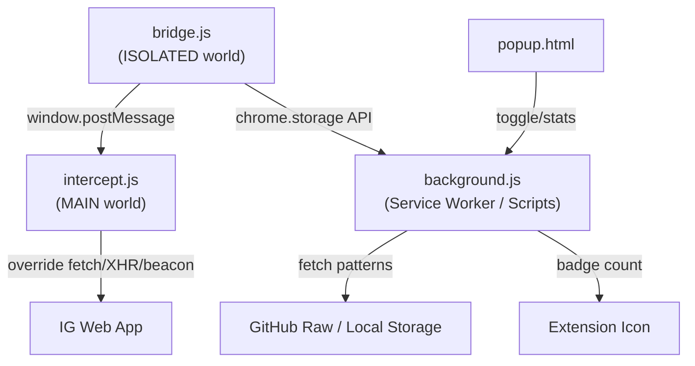

# Ghostory 👻

**Ghostory** is a cross-browser extension (Manifest V3) that lets you view Instagram stories completely anonymously. It intercepts and drops the `PolarisStoriesV3SeenMutation` GraphQL request that tells the server you've viewed a story, while allowing the actual media (images/videos) to load and play normally.

## ✨ Features

- **True Stealth:** Intercepts the exact GraphQL mutation — your name will never appear on the viewer list.
- **Cross-Browser:** Works on Chrome, Edge, Brave, and Firefox.
- **Dynamic Pattern Matching:** Instagram may change their internal API names at any time. Ghostory uses an editable `patterns.json` file, so you can update patterns without rewriting code.
- **Disabled by Default:** The extension starts OFF after installation to prevent unintended behavior. Toggle it ON when you need it.
- **Zero Data Collection:** Everything is processed locally in your browser. No data is sent anywhere.

---

## 🚀 Installation

### For Chrome / Edge / Brave:
1. Download or clone this repository.
2. **Important!** Copy `manifest.chrome.json` over `manifest.json`:
   ```
   copy manifest.chrome.json manifest.json
   ```
3. Open your browser and navigate to `chrome://extensions/` (or `edge://extensions/`).
4. Turn on **Developer mode** in the top right corner.
5. Click **Load unpacked** and select the `Ghostory` folder.
6. Done! Click the extension icon to toggle stealth mode **ON** before viewing stories.

### For Firefox:
1. Download or clone this repository.
2. Navigate to `about:debugging#/runtime/this-firefox`.
3. Click **Load Temporary Add-on...**
4. Select the `manifest.json` file inside the repository folder.
5. Toggle stealth mode ON in the popup.

> ⚠️ **Note:** The default `manifest.json` is configured for Firefox (uses `background.scripts`). For Chrome, you must replace it with `manifest.chrome.json` (which uses `background.service_worker`).

---

## 🛠️ หลักการทำงานทางเทคนิค (How It Works)

### Architecture Overview



Extension บล็อกโฆษณาหรือส่วนขยายรุ่นเก่าๆ มักจะใช้ API ที่ชื่อว่า `webRequest` เพื่อสกัดกั้นการส่งข้อมูล แต่หลังจากที่เบราว์เซอร์บังคับใช้ **Manifest V3** ข้อจำกัดต่างๆ ก็มีมากขึ้น ทำให้การดักจับเนื้อหาใน Payload (เช่น ข้อมูลเจาะจงใน GraphQL) ทำได้ยากและไม่เนียนตา

**Ghostory** จึงใช้วิธีที่ล้ำลึกกว่านั้น โดยการเข้าไปแทรกแซงตรงถึง "ระดับการประมวลผลของหน้าเว็บ" (Execution Context) โดยตรง:

1. **การแทรกซึมระดับ MAIN World**: Ghostory จะฉีดสคริปต์ (`intercept.js`) เข้าไปในโลกของการทำงานหลัก (MAIN World) ของเบราว์เซอร์ ซึ่งเป็นพื้นที่เดียวกับที่โค้ด JavaScript ของ Instagram ทำงานอยู่ โดยเราจะฝังตัวเข้าไป **"ก่อน"** ที่หน้าเว็บหรือสคริปต์ของไอจีจะโหลดเสร็จ
2. **การยึดคำสั่งส่งข้อมูล (API Overriding)**: เราทำการดักจับและเขียนทับฟังก์ชันพื้นฐานที่เบราว์เซอร์ใช้ส่งข้อมูล ได้แก่ `window.fetch`, `XMLHttpRequest` และ `navigator.sendBeacon` เพื่อขอตรวจของก่อนส่งออกเสมอ
3. **การสแกนเนื้อหา (Payload Inspection)**: ทุกครั้งที่คุณกดดูสตอรี่ Instagram จะแอบส่งข้อมูลไปบอกเซิร์ฟเวอร์ (Telemetry) Ghostory จะดักจับ Request ขาออกเหล่านี้และสแกนตรวจหาคีย์เวิร์ดใน Payload, URL และ Headers (เช่น `X-Fb-Friendly-Name`)
4. **ทำลายหลักฐาน "การดู"**: เป้าหมายหลักของเราคือ Request ที่เป็น GraphQL Mutation ที่มีชื่อว่า `PolarisStoriesV3SeenMutation` ซึ่งตัวมันจะพกข้อมูลเวลาที่คุณดู (`viewSeenAt`) ส่งกลับไปที่เซิร์ฟเวอร์
5. **วิชาลวงตา (Fake 200 OK Response)**: ถ้าเราแค่กด Block หรือทำลาย Request ทิ้งดื้อๆ เว็บ Instagram จะเกิด Error หมุนค้าง หรือพยายามส่งข้อมูลซ้ำรัวๆ ไม่หยุด (Infinite Retry) เพื่อแก้ปัญหานี้ Ghostory จะทำการทำลาย Request ทิ้งแบบเงียบๆ แล้ว **"สร้างคำตอบปลอม (Fake 200 OK)"** ตอบกลับไปหาตัวแอป Instagram แทน ทำให้ฝั่งตัวแอปรู้สึกว่า "ส่งข้อมูลสำเร็จแล้ว" และโหลดสตอรี่ให้เราดูต่อตามปกติ... ในขณะที่เซิร์ฟเวอร์ของ Meta ไม่เคยได้รับรู้เลยว่าคุณเพิ่งกดดูไป!

---

## 📁 File Structure

```
Ghostory/
├── manifest.json              # Firefox (default)
├── manifest.chrome.json       # Chrome / Edge / Brave
├── manifest.firefox.json      # Firefox backup
├── icons/
│   ├── icon16.png
│   ├── icon48.png
│   └── icon128.png
└── src/
    ├── intercept.js           # MAIN world — intercepts fetch/XHR/beacon
    ├── bridge.js              # ISOLATED world — bridges Extension API to page
    ├── background.js          # Service worker / Background script
    ├── patterns.json          # Block patterns (editable if IG changes API)
    ├── popup.html             # Extension popup UI
    ├── popup.js               # Popup logic
    └── popup.css              # Popup styling
```

---

## 📝 Disclaimer

This project is for educational and privacy purposes only. It is not affiliated with, endorsed, or sponsored by Instagram or Meta. Use at your own risk.
